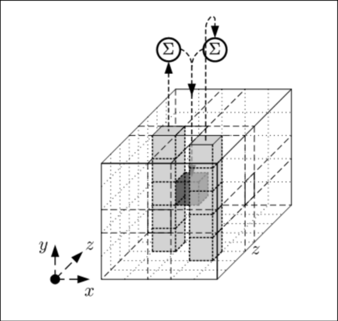
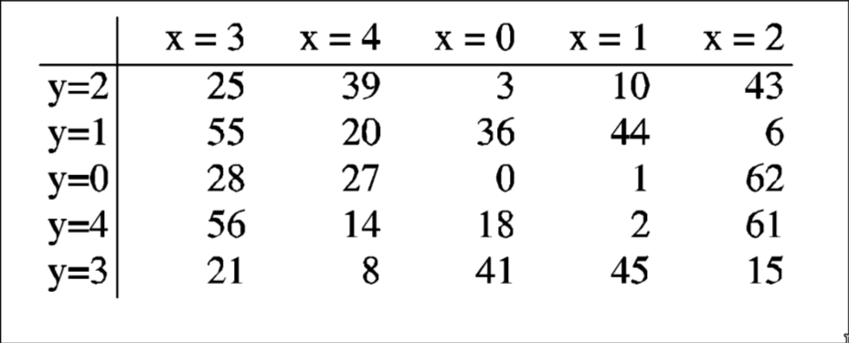
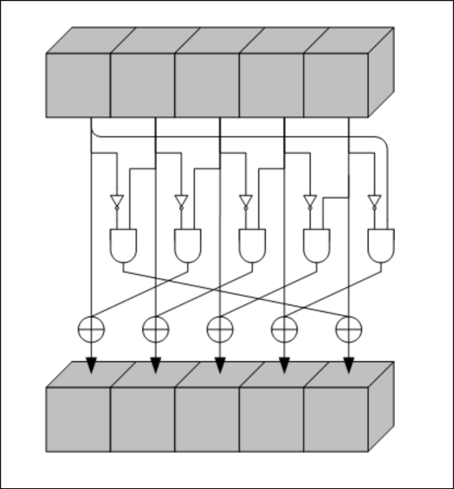
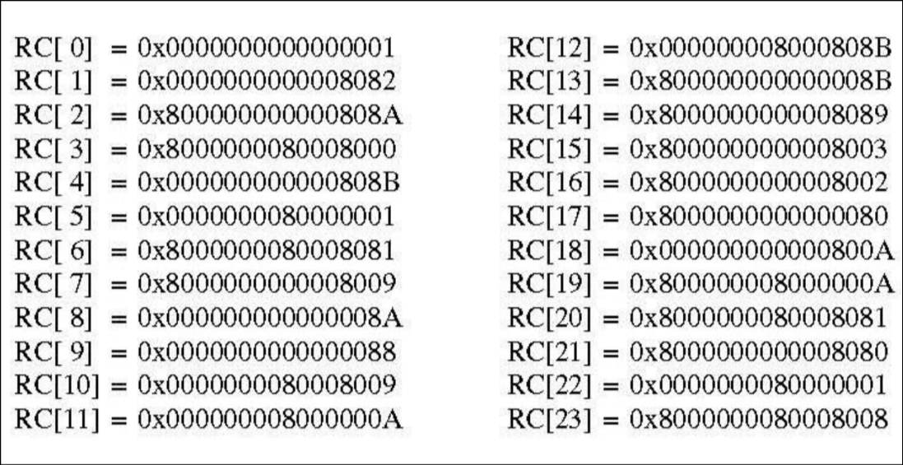

# The Keccak-f[1600] permutation

The keccak-f[1600] permutation proceeds in 24 identical rounds. Each round consists of 5 distinct steps: $\theta, \rho, \pi, \chi, \iota$. Each step mutates the current *internal state*.

## The state

The state of the permutation consists of 1600 bits. These bits are first arranged in 64-bit words that are called *lanes*. Then we arrange the state as a 5x5 grid of lanes. 

### $\theta$ step

Each of the 1600 state bits are replaced by the XOR sum of 11 bits:
- original bit 
- 5-bit column "to the left"
- 5-bit column "to the front-right"

In particular, given a state $A[x,y]$:

- Xor along the $y$ axis: $C[x] = A[x,0] \oplus A[x,1] \oplus A[x,2] \oplus A[x,3] \oplus A[x,4]$

- Xor the left and right-front ones: $D[x] = C[x-1] \oplus rot(C[x+1,1])$

- Xor with the initial bit: $A[x,y] = A[x,y] \oplus D[x]$

### $\rho$ and $\pi$ steps

These steps operate on words of length 64 on the z-axis. In particular, given an input state $A[x,y]$ it produces an output state by the following operations:

- $\rho$: rotate each word by fixed number of positions $TEMP[x,y] = rot(A[X,Y], r[X,Y])$
- $\pi$: permute the words $B[y, 2x+3y] = TEMP[x,y]$

The rotations $r[X,Y]$ are given here:

### $\chi$ step

On input state $B[x,y]$ it produces the output state as $B[x,y] \oplus (\lnot B[x+1, y] \land B[x+2, y])$

Basically, 
1. take the two right bits, 
2. invert the first
3. AND them
4. XOR with original

### $\iota$ step

This steps simply XORS the round constant with the state element $A[0,0]$, that is, it computes $A[0,0] =  A[0,0] \oplus RC[i]$ where $i$ is the round.

